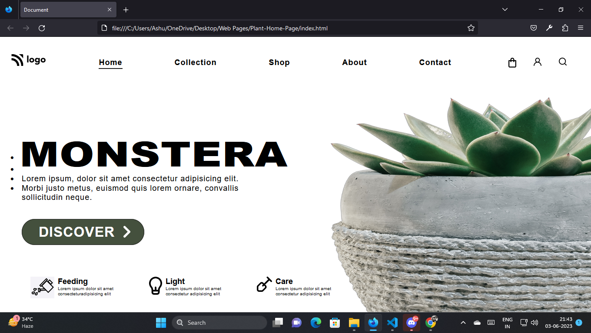

# Plant Home Page 

## Project Live Link: [Crypto Landing Page](https://plant-homee.netlify.app/)

Screenshot

## Learnings from this project

- Got to know how to select elements for styling using id.
- Learned more about pseudo classes pseudo selectors using first child and nth child property.
- Learned to change the fonts using google fonts.

## Time Taken to finish the project

- It took me approximately 3-3.5 hours to complete this project.
